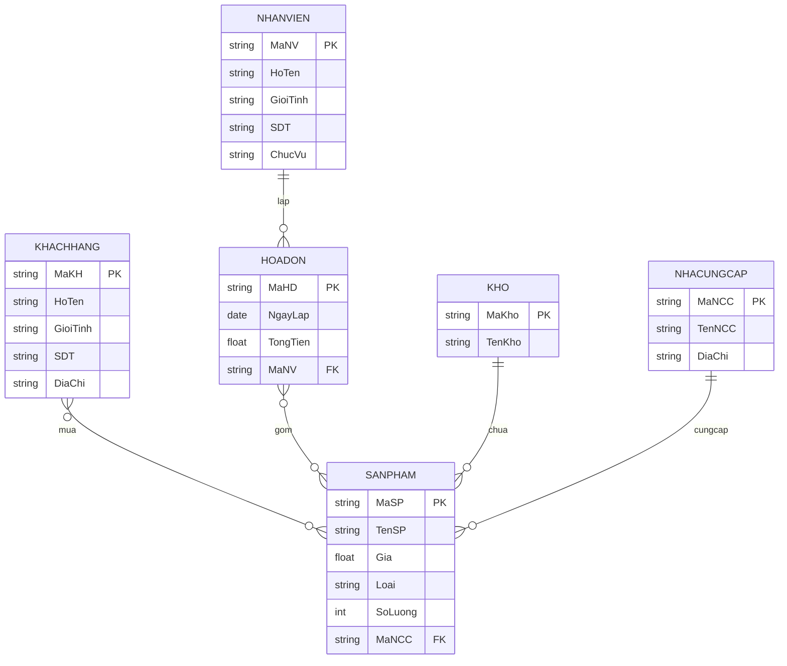

# Thiết kế hệ thống dữ liệu cho hệ thống quán lí cửa hàng máy tính

BDF

```mermaid
flowchart TD
    A[Quản lý cửa hàng máy tính]

    %% Level 1
    A --> B1[Quản lý nhập hàng]
    A --> B2[Quản lý khách hàng]
    A --> B3[Quản lý nhân viên]
    A --> B4[Quản lý sản phẩm]
    A --> B5[Quản lý bán hàng]
    A --> B6[Quản lý nhà cung cấp]
    A --> B7[Quản lý bảo hành]
    A --> B8[Quản lý đặt hàng]
    A --> B9[Quản lý kho]
    A --> B10[Báo cáo thống kê]

    %% Nhập hàng
    B1 --> B1a[Lập phiếu nhập]
    B1 --> B1b[Tìm kiếm phiếu nhập]
    B1 --> B1c[Sửa phiếu nhập]

    %% Khách hàng
    B2 --> B2a[Thêm khách hàng]
    B2 --> B2b[Sửa khách hàng]
    B2 --> B2c[Xóa khách hàng]
    B2 --> B2d[Tìm kiếm khách hàng]

    %% Nhân viên
    B3 --> B3a[Thêm nhân viên]
    B3 --> B3b[Sửa nhân viên]
    B3 --> B3c[Xóa nhân viên]
    B3 --> B3d[Tìm kiếm nhân viên]

    %% Sản phẩm
    B4 --> B4a[Thêm sản phẩm]
    B4 --> B4b[Sửa sản phẩm]
    B4 --> B4c[Xóa sản phẩm]
    B4 --> B4d[Tìm kiếm theo tên]
    B4 --> B4e[Tìm kiếm theo loại]

    %% Bán hàng
    B5 --> B5a[Tạo phiếu xuất]
    B5 --> B5b[Sửa phiếu xuất]
    B5 --> B5c[Tìm phiếu xuất]

    %% Nhà cung cấp
    B6 --> B6a[Thêm NCC]
    B6 --> B6b[Xóa NCC]
    B6 --> B6c[Tìm NCC]

    %% Bảo hành
    B7 --> B7a[Tạo phiếu BH]
    B7 --> B7b[Sửa phiếu BH]
    B7 --> B7c[Tìm phiếu BH]

    %% Đặt hàng
    B8 --> B8a[Tạo phiếu đặt]
    B8 --> B8b[Sửa phiếu đặt]
    B8 --> B8c[Tìm phiếu đặt]

    %% Kho
    B9 --> B9a[Nhập kho]
    B9 --> B9b[Xuất kho]

    %% Báo cáo
    B10 --> B10a[Báo cáo nhập]
    B10 --> B10b[Báo cáo xuất]
    B10 --> B10c[Báo cáo doanh thu]
    B10 --> B10d[Báo cáo tồn kho]
```

ERD

```mermaid
erDiagram

    NHANVIEN {
        string MaNV PK
        string HoTen
        string GioiTinh
        string SDT
        string ChucVu
    }

    KHACHHANG {
        string MaKH PK
        string HoTen
        string GioiTinh
        string SDT
        string DiaChi
    }

    SANPHAM {
        string MaSP PK
        string TenSP
        float Gia
        string Loai
        int SoLuong
        string MaNCC FK
    }

    KHO {
        string MaKho PK
        string TenKho
    }

    NHACUNGCAP {
        string MaNCC PK
        string TenNCC
        string DiaChi
    }

    HOADON {
        string MaHD PK
        date NgayLap
        float TongTien
        string MaNV FK
    }

    %% Relationships (crow's foot)

    %% NhanVien lap HoaDon (1 - n)
    NHANVIEN ||--o{ HOADON : lap

    %% KhachHang mua SanPham (m - n)
    KHACHHANG }o--o{ SANPHAM : mua

    %% HoaDon gom SanPham (m - n)
    HOADON }o--o{ SANPHAM : gom

    %% Kho chua SanPham (1 - n)
    KHO ||--o{ SANPHAM : chua

    %% NhaCungCap cung cap SanPham (1 - n)
    NHACUNGCAP ||--o{ SANPHAM : cungcap
```