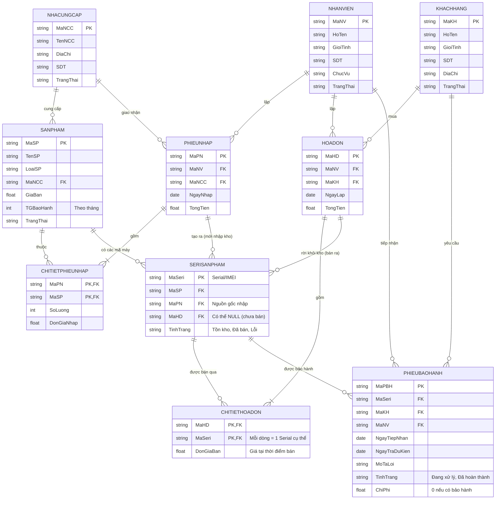

# Thiết kế hệ thống dữ liệu cho hệ thống quản lý cửa hàng máy tính

## 1. Sơ đồ phân rã chức năng (BFD)

```mermaid
flowchart TD
    A[Quản lý cửa hàng máy tính]

    %% Level 1
    A --> B1[Quản lý nhập hàng]
    A --> B2[Quản lý khách hàng]
    A --> B3[Quản lý nhân viên]
    A --> B4[Quản lý sản phẩm]
    A --> B5[Quản lý bán hàng]
    A --> B6[Quản lý nhà cung cấp]
    A --> B7[Quản lý bảo hành]
    A --> B10[Báo cáo thống kê]

    %% Nhập hàng
    B1 --> B1a[Lập phiếu nhập]
    B1 --> B1b[Tìm kiếm phiếu nhập]
    B1 --> B1c[Sửa phiếu nhập]

    %% Khách hàng
    B2 --> B2a[Thêm khách hàng]
    B2 --> B2b[Sửa khách hàng]
    B2 --> B2c[Xóa khách hàng]
    B2 --> B2d[Tìm kiếm khách hàng]

    %% Nhân viên
    B3 --> B3a[Thêm nhân viên]
    B3 --> B3b[Sửa nhân viên]
    B3 --> B3c[Xóa nhân viên]
    B3 --> B3d[Tìm kiếm nhân viên]

    %% Sản phẩm
    B4 --> B4a[Thêm sản phẩm]
    B4 --> B4b[Sửa sản phẩm]
    B4 --> B4c[Xóa sản phẩm]
    B4 --> B4d[Tìm kiếm theo tên]
    B4 --> B4e[Tìm kiếm theo loại]

    %% Bán hàng
    %% Thêm dấu ngoặc kép để bọc văn bản lại vì dấu ngoặc đơn bên trong làm lỗi syntax
    B5 --> B5a["Tạo phiếu xuất (Hóa đơn)"]
    B5 --> B5b[Sửa hóa đơn]
    B5 --> B5c[Tìm hóa đơn]

    %% Nhà cung cấp
    B6 --> B6a[Thêm NCC]
    B6 --> B6b[Xóa NCC]
    B6 --> B6c[Tìm NCC]

    %% Bảo hành
    B7 --> B7a[Tạo phiếu BH]
    B7 --> B7b[Sửa phiếu BH]
    B7 --> B7c[Tìm phiếu BH]

    %% Báo cáo
    B10 --> B10a[Báo cáo nhập]
    B10 --> B10b[Báo cáo xuất]
    B10 --> B10c[Báo cáo doanh thu]
    B10 --> B10d[Báo cáo tồn kho]
```

*(Ghi chú: Đã loại bỏ nhánh chức năng Kho phân mảnh và gộp chung vào cấu trúc của các nghiệp vụ xuất/nhập, phù hợp với kiến trúc 1 kho duy nhất).*

## 2. Mô hình Thực thể - Liên kết (ERD v2)

So với mô hình cũ, ERD này đã được **chuẩn hóa**, không còn quan hệ N-Multiple (Many-to-Many). Bổ sung thêm các bảng `PHIEUNHAP`, bảng trung gian (Chi tiết), và 2 bảng đặc thù là `SERISANPHAM` và `PHIEUBAOHANH` theo yêu cầu BFD mới.

## 3. Lược đồ dữ liệu quan hệ (Relational Schema)

Mô hình dữ liệu Mức Quan hệ tuân thủ 3NF:

1. `NHANVIEN`(**MaNV**, HoTen, GioiTinh, SDT, ChucVu, TrangThai)
2. `KHACHHANG`(**MaKH**, HoTen, GioiTinh, SDT, DiaChi, TrangThai)
3. `NHACUNGCAP`(**MaNCC**, TenNCC, DiaChi, SDT, TrangThai)
4. `SANPHAM`(**MaSP**, TenSP, LoaiSP, *MaNCC*, GiaBan, TGBaoHanh, TrangThai)
5. `PHIEUNHAP`(**MaPN**, *MaNV*, *MaNCC*, NgayNhap, TongTien)
6. `CHITIETPHIEUNHAP`(**MaPN**, **MaSP**, SoLuong, DonGiaNhap)
7. `HOADON`(**MaHD**, *MaNV*, *MaKH*, NgayLap, TongTien)
8. `CHITIETHOADON`(**MaHD**, ***MaSeri***, DonGiaBan)
9. `SERISANPHAM`(**MaSeri**, *MaSP*, *MaPN*, *MaHD*, TinhTrang)
10. `PHIEUBAOHANH`(**MaPBH**, *MaSeri*, *MaKH*, *MaNV*, NgayTiepNhan, NgayTraDuKien, MoTaLoi, TinhTrang, ChiPhi)