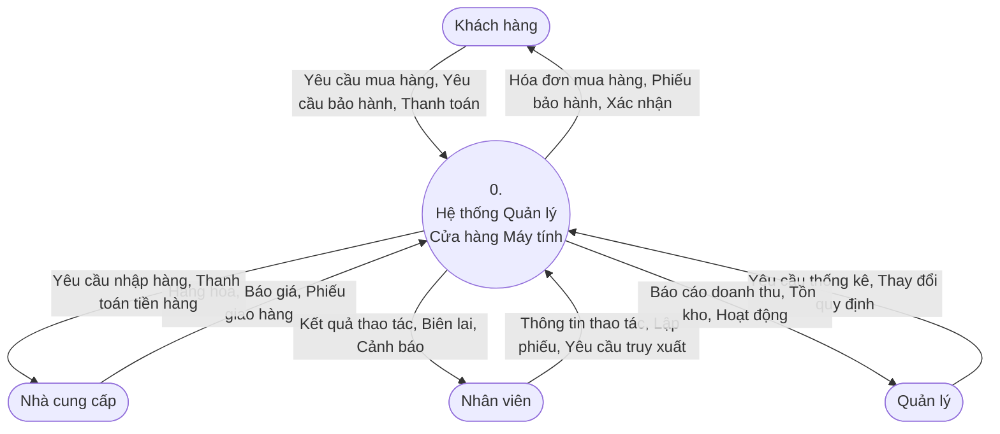
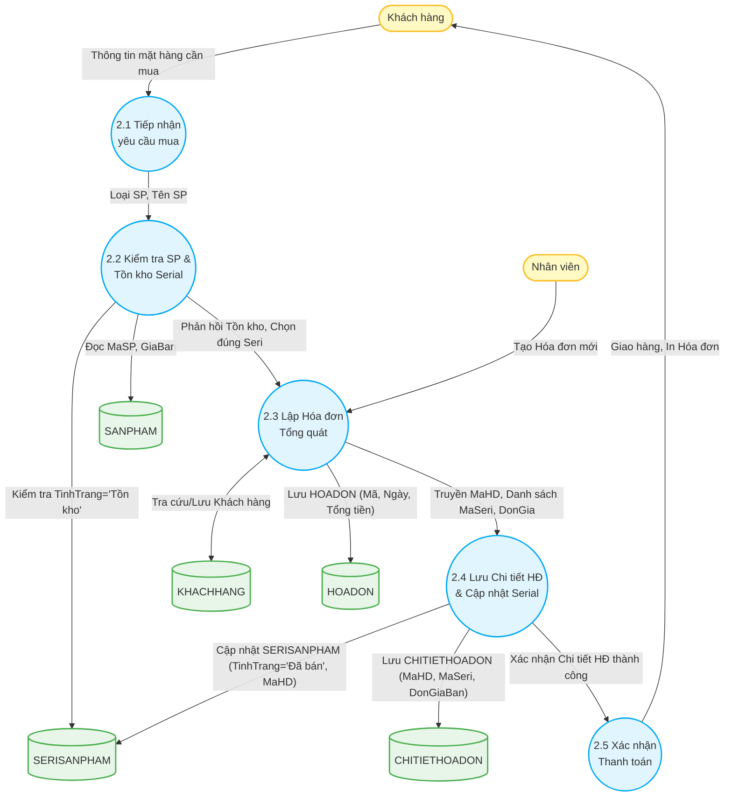
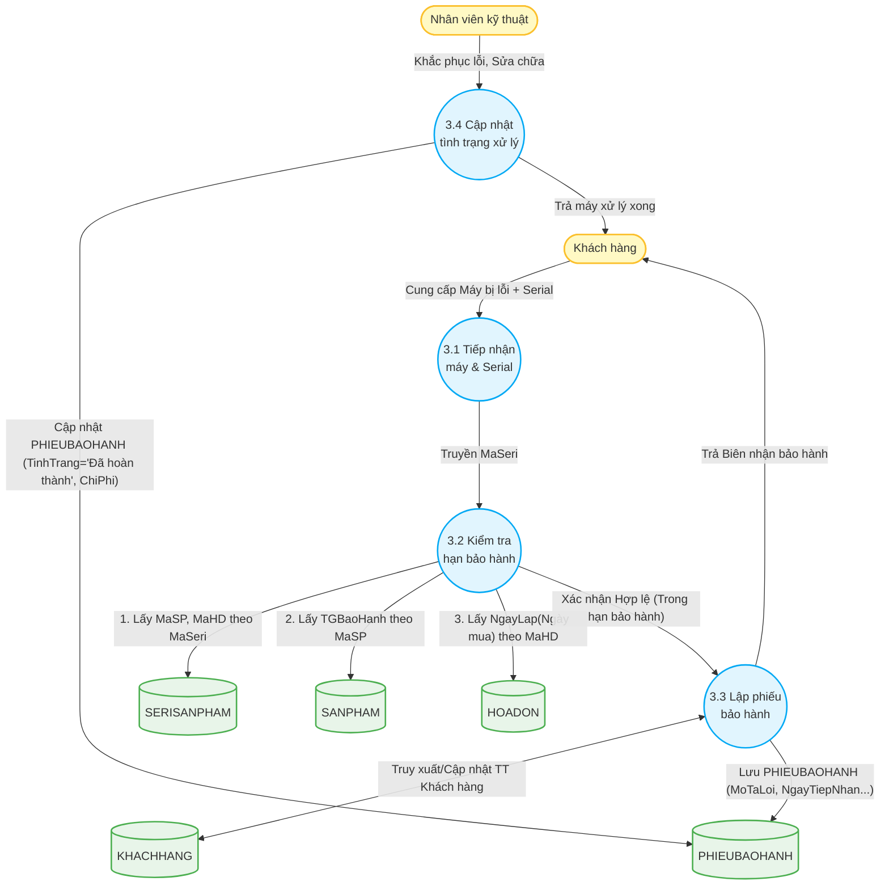

# Thiết kế Sơ đồ Luồng Dữ liệu (DFD)

Tài liệu này phân tích chi tiết các Sơ đồ Luồng Dữ liệu (Data Flow Diagram - DFD) dựa trên cấu trúc cơ sở dữ liệu và yêu cầu nghiệp vụ của hệ thống Quản lý Cửa hàng Máy tính. 

Đặc biệt, tài liệu này mô tả cách luồng dữ liệu tương tác chính xác với các Data Store (tương ứng với các bảng trong CSDL): `KHACHHANG`, `NHANVIEN`, `NHACUNGCAP`, `SANPHAM`, `PHIEUNHAP`, `CHITIETPHIEUNHAP`, `HOADON`, `CHITIETHOADON`, `SERISANPHAM`, và `PHIEUBAOHANH`.

---

## 1. DFD Level 0 (Sơ đồ Ngữ cảnh)

Sơ đồ Ngữ cảnh (Context Diagram) cung cấp cái nhìn tổng quan nhất về hệ thống, thể hiện cách hệ thống tương tác với các tác nhân bên ngoài (Entities) nhưng không đi sâu vào chi tiết bên trong.

---

## 2. DFD Level 1 (Phân rã Hệ thống)

Ở mức độ phân rã đầu tiên, hệ thống được chia thành 4 tiến trình (Process) cốt lõi: Quản lý Nhập kho/Sản phẩm, Quản lý Bán hàng, Quản lý Bảo hành, và Báo cáo thống kê. Tất cả Data Store đều được ánh xạ chính xác bằng tên bảng trong lược đồ dữ liệu (Relational Schema).

```mermaid
flowchart TD
    %% Định dạng style cho các thành phần
    classDef process fill:#e1f5fe,stroke:#03a9f4,stroke-width:2px;
    classDef entity fill:#fff9c4,stroke:#fbc02d,stroke-width:2px;
    classDef store fill:#e8f5e9,stroke:#4caf50,stroke-width:2px;

    %% Entities
    KH([Khách hàng]):::entity
    NV([Nhân viên]):::entity
    NCC([Nhà cung cấp]):::entity
    QL([Quản lý]):::entity

    %% Processes
    P1((1.0 Quản lý Nhập kho\n& Sản phẩm)):::process
    P2((2.0 Quản lý\nBán hàng)):::process
    P3((3.0 Quản lý\nBảo hành)):::process
    P4((4.0 Báo cáo\nthống kê)):::process

    %% Data Stores
    D1[(KHACHHANG)]:::store
    D2[(NHANVIEN)]:::store
    D3[(NHACUNGCAP)]:::store
    D4[(SANPHAM)]:::store
    D5[(PHIEUNHAP)]:::store
    D6[(CHITIETPHIEUNHAP)]:::store
    D7[(HOADON)]:::store
    D8[(CHITIETHOADON)]:::store
    D9[(SERISANPHAM)]:::store
    D10[(PHIEUBAOHANH)]:::store

    %% Luồng dữ liệu Process 1.0 (Nhập kho/Sản phẩm)
    NCC -->|Giao hàng/Thông tin SP| P1
    NV -->|Lập phiếu nhập/Thêm SP| P1
    P1 -->|Lưu TT Nhà cung cấp| D3
    P1 -->|Lưu TT Sản phẩm| D4
    P1 -->|Lưu phiếu nhập| D5
    P1 -->|Lưu chi tiết PN| D6
    P1 -->|Sinh mã máy/vào kho| D9

    %% Luồng dữ liệu Process 2.0 (Bán hàng)
    KH -->|Yêu cầu mua hàng| P2
    NV -->|Tạo hóa đơn, Quét mã| P2
    P2 -->|Lưu/Tìm TT Khách hàng| D1
    P2 -->|Tra cứu SP| D4
    P2 -->|Tra cứu Tồn kho Serial| D9
    P2 -->|Lưu hóa đơn| D7
    P2 -->|Lưu chi tiết HĐ| D8
    P2 -->|Cập nhật Đã bán + MaHD| D9
    P2 -->|Xuất hóa đơn| KH

    %% Luồng dữ liệu Process 3.0 (Bảo hành)
    KH -->|Cung cấp Serial| P3
    P3 -->|Đọc TGBaoHanh của SP| D4
    P3 -->|Đọc Ngày bán qua MaHD| D7
    P3 -->|Lấy MaSP, MaHD| D9
    P3 -->|Lưu Phiếu bảo hành| D10
    P3 -->|Cập nhật trạng thái| D10
    P3 -->|Trả máy bảo hành| KH

    %% Luồng dữ liệu Process 4.0 (Báo cáo)
    QL -->|Tham số báo cáo| P4
    P4 -->|Đọc Phiếu Nhập, Chi Tiết| D5
    P4 -->|Đọc Hóa Đơn, Chi Tiết| D7
    P4 -->|Đọc Tình Trạng Serial| D9
    P4 -->|Đọc Doanh Thu, SP| D4
    P4 -->|Xuất báo cáo| QL
```

---

## 3. DFD Level 2

Phân rã chi tiết cho cấu trúc lõi liên quan đến quản lý Tồn kho vật lý (qua Serial) và Vòng đời sản phẩm (Bảo hành).

### 3.1 DFD Level 2: Quá trình Bán hàng (Tiến trình 2.0)

Quá trình bán hàng không chỉ lưu thông tin tổng quan của Hóa đơn mà còn yêu cầu kiểm tra và cấp phát chính xác các mã định danh phần cứng (Serial/IMEI). Khi chốt đơn, Serial sẽ được chuyển trạng thái nhằm cập nhật kho.

### 3.2 DFD Level 2: Quá trình Bảo hành (Tiến trình 3.0)

Khi Khách hàng mang máy đã mua đến bảo hành. Hệ thống không dựa trên hóa đơn giấy (người dùng làm mất) mà dựa trực tiếp vào Serial ghi nhận trên phần cứng, sau đó lấy thông số cấu hình thời gian bảo hành, đối chiếu ngày mua để xác định hợp lệ.

